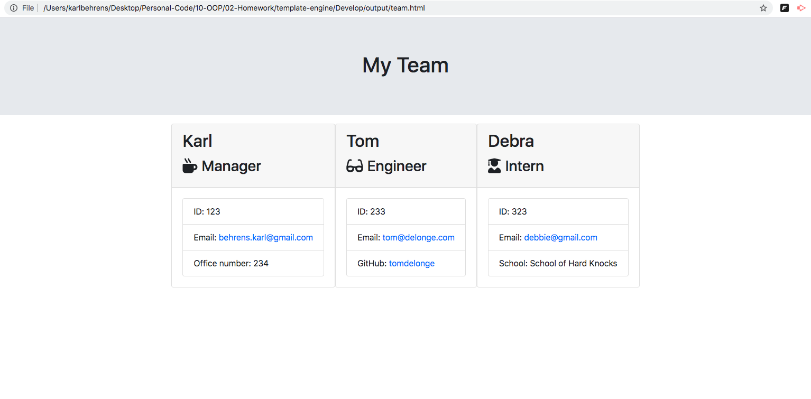

# Template Engine

## Description:

This app runs Node commands in your terminal to build a html site with the information of your professional team. Input info for the Manager, Engineers, and Interns to be displayed on your site which is created by the app complete with html, css, and javascript implementation. Useful for any team to build a quick and simple professional site with contact info and links to email and GitHub. 

## Table of Contents:
- [installation](#installation)
- [usage](#usage)
- [contribution](#contribution)
- [licenses](#licenses)
- [test](#test)
- [contact](#contact)

## Installation:
Clone the repository into your directory. Run 'npm install' to get the correct npm packages to run the app. Open the terminal for the 'Develop' folder and run 'node app.js'. Follow the prompts initialized by inquirer. Once Done building your team go check out the html file in the 'output' folder and open it in the browser to see your newly created site!

## Usage:
By managers to build a quick and simple site with their teams contact information.

## Contribution:
If you would like to contribute or have any recommendations please contact using the email or GitHub listed below

## Licenses:

    This is free and unencumbered software released into the public domain.

    Anyone is free to copy, modify, publish, use, compile, sell, or
    distribute this software, either in source code form or as a compiled
    binary, for any purpose, commercial or non - commercial, and by any
    means.

    In jurisdictions that recognize copyright laws, the author or authors
    of this software dedicate any and all copyright interest in the
    software to the public domain.We make this dedication for the benefit
    of the public at large and to the detriment of our heirs and
    successors.We intend this dedication to be an overt act of
    relinquishment in perpetuity of all present and future rights to this
    software under copyright law.

    THE SOFTWARE IS PROVIDED "AS IS", WITHOUT WARRANTY OF ANY KIND,
    EXPRESS OR IMPLIED, INCLUDING BUT NOT LIMITED TO THE WARRANTIES OF
    MERCHANTABILITY, FITNESS FOR A PARTICULAR PURPOSE AND NONINFRINGEMENT.
    IN NO EVENT SHALL THE AUTHORS BE LIABLE FOR ANY CLAIM, DAMAGES OR
    OTHER LIABILITY, WHETHER IN AN ACTION OF CONTRACT, TORT OR OTHERWISE,
    ARISING FROM, OUT OF OR IN CONNECTION WITH THE SOFTWARE OR THE USE OR
    OTHER DEALINGS IN THE SOFTWARE.

    For more information, please refer to < https://unlicense.org>

## Test:
Run 'npm run test' in the Develop folder after installing the npm packages to make sure the app functions correctly.

## Contact:

GitHub: https://github.com/behrenskarl

Email: behrens.karl@gmail.com